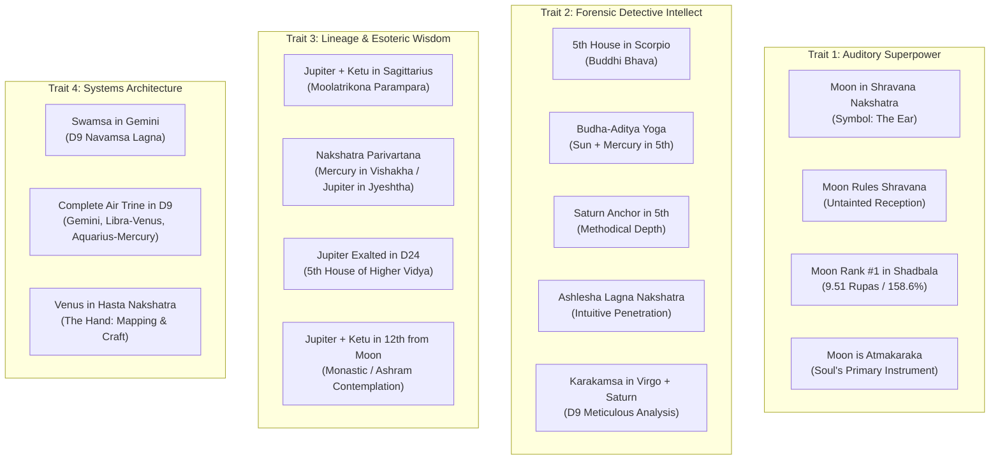

# Cognitive Blueprint & Learning Style Master Report
## Swami Shivapuri (Born November 10, 1983 • 22:20 CET • Osnabrück, Germany)

---

## 1. Executive Summary & Cognitive Architecture

This report delivers an exhaustive astrological and cognitive evaluation of **Swami Shivapuri’s learning style**, designed to identify the exact study methods, tools, and workflows that yield the highest cognitive return on investment.

Calculations are powered by **Astra’s Integrated Astrological Engine** (Tropical Signs, Campanus Bhavas, and Sidereal Equatorial Nakshatras anchored to the Dhruva Galactic Center), cross-referenced with Ernst Wilhelm’s foundational curriculum *The Foundation of Vedic Astrology: A Course in Cosmic Awareness*.

### High-Level Cognitive Summary

```
                      ┌──────────────────────────────────────────────┐
                      │            THE COGNITIVE ENGINE              │
                      └──────────────────────┬───────────────────────┘
                                             │
             ┌───────────────────────────────┼──────────────────────────────┐
             ▼                               ▼                              ▼
    [INPUT / RECEPTION]             [PROCESSING / INTELLECT]        [SYNTHESIS / WISDOM]
     Moon in Shravana                Scorpio 5th House               Jupiter + Ketu
   (Rank #1 Shadbala: 158%)         (Sun + Mercury + Saturn)         (Sagittarius Moolatrikona)
  Auditory, Receptive Mind        Forensic, Detective Intellect    Traditional Lineage Wisdom
```

| Cognitive Dimension | Astrological Signature | Functional Reality |
| :--- | :--- | :--- |
| **Primary Input Channel** | **Auditory Absorption** (*Shravana Nakshatra*, Moon Rank #1 Shadbala, Atmakaraka) | Learns fastest through **listening**: lectures, spoken dialogue, podcasts, and oral transmission. Spoken knowledge bypasses mental friction. |
| **Information Processing** | **Forensic Deep-Dive** (Scorpio 5th House, *Budha-Aditya*, Saturn conjoined) | Disdains superficial summaries. Needs to dismantle a system to its first principles to understand how and why it works. |
| **Cognitive Modeling** | **Visual Systems & Architecture** (*Gemini Swamsa*, Venus in Libra, Mercury & Rahu in Aquarius) | Thinks in relational graphs, schemas, maps, and multidimensional networks rather than linear text. |
| **Epistemological Bias** | **Traditional Lineage Wisdom (*Parampara*)** (Jupiter + Ketu in Sagittarius; Exalted Jupiter in D24) | Naturally drawn to classical, ancient, and spiritual masterworks. Seeks the timeless essence over temporary modern trends. |
| **Work Pace & Retention** | **Methodical Master** (Saturn in 5th House; Saturn conjunct Atmakaraka in D9) | Rejects rushing. Retains concepts permanently once thoroughly internalized. |

---

## 2. Multi-Layer Astrological Cross-Confirmations

In classical Jyotish, a single placement can be coincidental, but when a trait is verified across 4 to 5 independent divisional charts, perspectives, and asterisms (*Nakshatras*), it represents an immutable cognitive constant.

### Proof Matrix of Discovered Traits



---

## 3. Exhaustive Evaluation of Study Techniques & Learning Styles

To determine maximum learning efficiency, every common educational methodology is evaluated below against Shivapuri's specific astrological mechanisms.

---

### Tier 1: Superpower Techniques (Efficiency: 9.5 – 10 / 10)
*These techniques leverage his highest-scoring planetary strengths and produce maximum retention with the least friction.*

#### 1. High-Density Audio Immersion & Spaced Audio Listening (Score: 10/10)
* **Astrological Root:** Moon in *Shravana Nakshatra* (symbol: The Ear), Moon Rank #1 in Shadbala (158.6%), Moon as *Atmakaraka* (Soul Planet).
* **How it Works:** The Moon is the receptive vessel (*Manas*). In *Shravana*, the auditory nerve is the royal gateway to his subconscious memory. Reading dense books can sometimes cause eye fatigue or mental over-analysis, but hearing an expert explain a concept immediately anchors it into his memory.
* **Optimal Protocol:**
  * Use **Text-to-Speech (TTS)** tools to convert written PDFs, books, and articles into spoken audio.
  * Listen to foundational lectures, seminars, and audiobooks during walks or quiet contemplation.
  * Record your own voice explaining difficult concepts and replay it during downtime.

#### 2. Bi-Directional Graph Note-Taking & Systems Mapping (Zettelkasten / Obsidian) (Score: 9.5/10)
* **Astrological Root:** *Swamsa* in Gemini (Navamsa Ascendant) with the entire **Air Trine** activated: Venus in Libra (5th), Mercury + Rahu in Aquarius (9th).
* **How it Works:** Air signs perceive reality as an interconnected web of nodes, relations, and patterns. Linear notebook pages suffocate this talent. Graph-based note systems (like Obsidian or Roam Research) mirror his multi-dimensional mind.
* **Optimal Protocol:**
  * Abandon rigid hierarchical folders. Use atomic, linked Markdown notes with bi-directional tags (`[[Concept]]`).
  * Always include visual relationship schemas (Mermaid diagrams, flowcharts, node maps).
  * Let notes cluster organically into "knowledge maps" (*MOCs - Maps of Content*).

#### 3. Primary Source & Lineage-Based Study (*Parampara*) (Score: 9.5/10)
* **Astrological Root:** Jupiter conjunct Ketu in Sagittarius (home sign); Jupiter Exalted in Cancer in the 5th house of D24 (*Siddhamsa*).
* **How it Works:** Secondary textbooks and popularized summaries feel diluted and hollow to this mind. He flourishes when engaging directly with ancient root treatises, original commentaries, and unbroken teaching traditions.
* **Optimal Protocol:**
  * Study the foundational texts directly (BPHS, Jaimini Sutras, classic philosophical commentaries).
  * Avoid derivative pop-interpretations. Trace every rule back to its scriptural or mathematical origin.

---

### Tier 2: High-Yield Supporting Techniques (Efficiency: 8.0 – 9.0 / 10)
*These techniques are highly effective when tailored to his analytical depth.*

#### 4. The Feynman Technique (Teaching to Understand) (Score: 9.0/10)
* **Astrological Root:** Mercury in Vishakha (ruled by Jupiter, the Teacher); Mercury in the 10th house of D24; Jupiter in Sagittarius.
* **How it Works:** In the cognitive cycle, Mercury must formulate ideas so clearly that even a child can grasp them. Teaching or drafting educational guides forces his investigative Scorpio intellect to clarify every obscure nuance.
* **Optimal Protocol:**
  * When studying a new topic, write an article, prepare a mini-lecture, or explain it aloud to an imaginary student.
  * If a step feels fuzzy, go back to the source text until the explanation flows simply and intuitively.

#### 5. Reverse-Engineering & Hands-On System Building (Score: 8.5/10)
* **Astrological Root:** Mars in Virgo in the 3rd Campanus House; Rahu in Gemini / Aquarius.
* **How it Works:** Virgo is the sign of tools, diagnostic troubleshooting, and mechanics. Mars here loves testing logic under real-world conditions (such as coding astrological algorithms or testing chart calculation formulas).
* **Optimal Protocol:**
  * Don't just read an astrological rule—code it into a script, build a spreadsheet model, or test it against 50 real charts.
  * Learn through active experimentation and verification rather than passive belief.

#### 6. Atomized Conceptual Flashcards (Anki with the "Rule of 4") (Score: 8.0/10)
* **Astrological Root:** Saturn conjoining Mercury in the 5th house; Moon conjoining Saturn in D9 Virgo.
* **How it Works:**
  * **The Hazard:** If flashcards contain trivial trivia or long walls of text, Saturn will cause mental burnout and "Anki purgatory."
  * **The Solution:** Flashcards are tremendously efficient **only if they are strictly atomized into single conceptual units**.
* **Optimal Protocol (The Rule of 4):**
  * Break down large entities (Planets, Signs, Houses) into exactly 4 isolated cards:
    1. *Core Psychological Theme*
    2. *Physical / Biological Anatomy*
    3. *People & Relational Manifestations*
    4. *Material & Environmental Objects*
  * Avoid basic reverse guessing. Test from the principle to its specific manifestation.

---

### Tier 3: Moderate / Context-Dependent Techniques (Efficiency: 5.5 – 7.5 / 10)
*Use these only with conscious adaptations; otherwise, they generate cognitive friction.*

#### 7. Cornell Note-Taking (Score: 6.5/10)
* **Verdict:** Too linear and rigid. The two-column format restricts the holistic, networked connections that Gemini and Aquarius thrive on.
* **Adaptation:** Use Cornell notes only during live conferences or fast verbal lectures as a temporary capture tool, then immediately migrate the ideas into an Obsidian graph.

#### 8. Practice Testing / Multiple-Choice Quizzes (Score: 6.0/10)
* **Verdict:** Standard multiple-choice tests test surface recognition rather than structural understanding. They trigger frustration in a Scorpio 5th house mind that sees nuances where rigid answer keys demand oversimplification.
* **Adaptation:** Replace multiple-choice quizzes with open-ended essay questions or case-study chart analysis.

---

### Tier 4: Inefficient / Low-Yield Techniques (Efficiency: 2.0 – 4.0 / 10)
*Avoid these techniques; they work against his natural cognitive blueprint.*

#### 9. Rote Memorization & Cramming (Score: 3.0/10)
* **Astrological Reason:** Saturn in the 5th house hates superficial rushing. Cramming leads to rapid mental exhaustion and zero long-term retention.
* **Verdict:** **Avoid completely.** Replace with spaced auditory review and conceptual mastery.

#### 10. Unstructured Group Study & Study Circles (Score: 2.5/10)
* **Astrological Reason:** Leo Ascendant ruled by Sun in Scorpio (5th House); Moon in 12th from Jupiter/Ketu.
* **Verdict:** Group study usually operates at the pace of the slowest consensus and devolves into casual banter. Shivapuri’s deep-dive forensic intellect requires uninterrupted solitude (*Ekanta*) to drop into deep flow states.

---

## 4. Master Comparative Ranking Table

| Rank | Study Technique | Efficiency Rating | Astrological Driver | Key Benefit for Shivapuri | Common Pitfall to Avoid |
| :---: | :--- | :---: | :--- | :--- | :--- |
| **1** | **Auditory Absorption (TTS, Lectures, Podcasts)** | **10 / 10** | Moon in *Shravana* (#1 Shadbala) | Bypasses visual fatigue; sinks straight into memory | Passive background noise without conscious focus |
| **2** | **Bi-Directional Graph Notes (Obsidian / Zettelkasten)** | **9.5 / 10** | *Swamsa* in Gemini; D9 Air Trine | Matches his multi-dimensional systems brain | Over-collecting notes without linking them |
| **3** | **Primary Source Study (*Parampara*)** | **9.5 / 10** | Jupiter+Ketu in Sagittarius; Exalted D24 | Satisfies his spiritual craving for authentic root truth | Getting bogged down in linguistic pedantry |
| **4** | **The Feynman Technique (Teaching & Formulating)** | **9.0 / 10** | Mercury in *Vishakha*; D24 10th House | Clarifies complex concepts into simple language | Teaching before fully verifying mechanics |
| **5** | **Reverse-Engineering & System Building** | **8.5 / 10** | Mars in Virgo (3rd); Rahu in Gemini | Verifies theory through empirical code/data | Perfectionism delaying the start |
| **6** | **Atomized Conceptual Anki (Rule of 4)** | **8.0 / 10** | Saturn conjunct Mercury in 5th | Guarantees permanent memory retention | Adding bloated cards that induce fatigue |
| **7** | **Cornell Notes** | **6.5 / 10** | Virgo 2nd House | Good for raw real-time meeting capture | Too linear for holistic synthesis |
| **8** | **Practice Quizzes / Multiple Choice** | **6.0 / 10** | Mercury in Scorpio | Useful for quick factual checks | Oversimplifies complex astrological logic |
| **9** | **Rote Cramming / Speed Reading** | **3.0 / 10** | Saturn in 5th House | None; highly destructive to retention | Creates illusion of competence without depth |
| **10** | **Unstructured Group Study** | **2.5 / 10** | Sun in Scorpio; 12th House Moon | None; breaks solitary concentration | Wasting hours on conversational tangents |

---

## 5. The Ideal Daily & Weekly Study Workflow

Based on this blueprint, here is the optimal, friction-free learning cadence:

```
                      DAILY 3-STAGE LEARNING RITUAL
 ┌────────────────────────┐      ┌────────────────────────┐      ┌────────────────────────┐
 │  STAGE 1: THE RECEPTOR │      │ THE DETECTIVE WORKSHOP │      │ THE ARCHITECT'S VAULT  │
 │  (Morning / Auditory)  │ ───► │ (Midday / Deep Work)   │ ───► │ (Evening / Synthesis)  │
 │  • Listen to lectures  │      │ • Read primary texts   │      │ • Create linked notes  │
 │  • High-quality audio  │      │ • Test code & charts   │      │ • Review atomized Anki │
 │  • Text-to-Speech      │      │ • Dissect mechanisms   │      │ • Draw visual schemas  │
 └────────────────────────┘      └────────────────────────┘      └────────────────────────┘
```

1. **Stage 1 (Morning): Audio Absorption (*Shravana Activation*)**
   * Listen to 30–60 minutes of high-level lectures, podcasts, or TTS-converted texts during a morning walk or quiet session. Let the ideas wash over the receptive Moon.
2. **Stage 2 (Focus Block): Solitary Forensic Dissection (*Scorpio 5th House*)**
   * Sit in complete solitude. Open the primary classical sources, examine real chart data, write code, and document the exact mechanics.
3. **Stage 3 (Evening): Visual & Systems Crystallization (*Gemini/Air Trine Vault*)**
   * Convert the day's insights into an atomic note in Obsidian.
   * Add a visual flowchart or schema.
   * If core definitions or classifications need permanent recall, create 4 atomized Anki cards following the Rule of 4.

---

## 6. Technical Astrological Appendix

* **Birth Data:** November 10, 1983 • 22:20 CET (UT+1:00) • Osnabrück, Germany (52°12'11" N, 8°02'41" E)
* **Ascendant (*Lagna*):** Leo 9°36' (Campanus House 1: Leo 9°36')
* **Nakshatras (Sidereal Equatorial / Dhruva Galactic Center):**
  * *Lagna:* Ashlesha (Pada 2) • Ruler: Mercury
  * *Sun:* Vishakha (Pada 2) • Ruler: Jupiter
  * *Moon:* Shravana (Pada 1) • Ruler: Moon
  * *Mars:* Uttara Phalguni (Pada 4) • Ruler: Sun
  * *Mercury:* Vishakha (Pada 4) • Ruler: Jupiter
  * *Jupiter:* Jyeshtha (Pada 3) • Ruler: Mercury
  * *Venus:* Hasta (Pada 1) • Ruler: Moon
  * *Saturn:* Swati (Pada 4) • Ruler: Rahu
  * *Rahu:* Mrigashira (Pada 1) • Ruler: Mars
  * *Ketu:* Jyeshtha (Pada 3) • Ruler: Mercury
* **Shadbala Strength Ranking:**
  1. *Moon:* 9.51 Rupas (158.6% of required) — **Rank #1**
  2. *Venus:* 8.99 Rupas (163.5% of required) — **Rank #2**
  3. *Mercury:* 6.61 Rupas (94.4% of required) — **Rank #3**
  4. *Saturn:* 6.44 Rupas (128.9% of required) — **Rank #4**
  5. *Jupiter:* 6.29 Rupas (96.8% of required) — **Rank #5**
  6. *Mars:* 6.02 Rupas (120.4% of required) — **Rank #6**
  7. *Sun:* 5.28 Rupas (81.2% of required) — **Rank #7**
* **D9 Navamsa Key Placements:**
  * *Swamsa (Lagna):* Gemini 26°23'
  * *5th House (Libra):* Venus (Own Sign)
  * *9th House (Aquarius):* Mercury & Rahu
  * *Karakamsa (Virgo):* Moon (Atmakaraka) conjunct Saturn
* **D24 Siddhamsa Key Placements:**
  * *Lagna:* Pisces 20°22'
  * *5th House (Cancer):* Jupiter (**Exalted**)
  * *9th House (Scorpio):* Mars (**Own Sign**)
  * *10th House (Sagittarius):* Mercury
  * *11th House (Capricorn):* Saturn (**Own Sign**)
