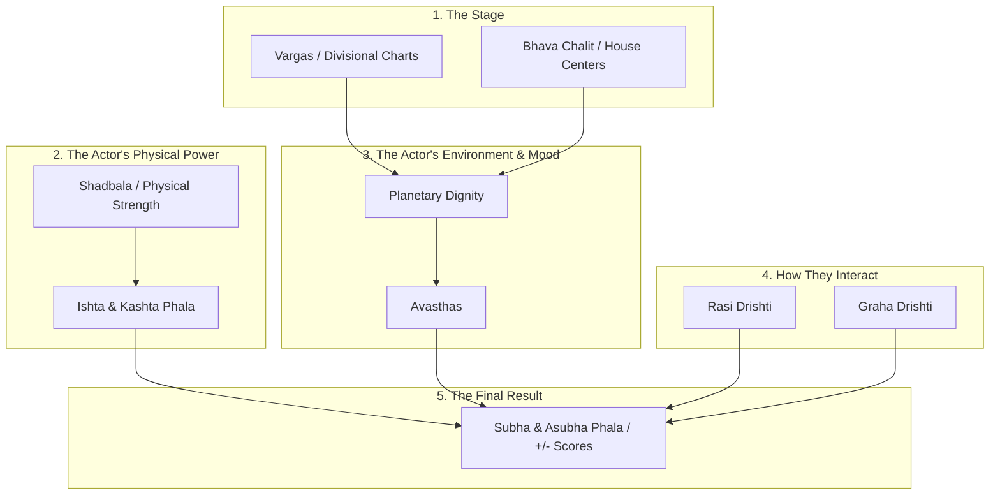

# Astra Astrology Engines: Concept Overview

Astrology can easily become overwhelming because there are dozens of calculations that all seem to overlap. This document serves as a "mental map." 

It categorizes every engine we have built (and are building) into a logical pipeline. Think of the planets as actors in a movie. Each calculation tells us something different about the actor.

## The Mental Map (Mermaid Diagram)

---

## The Dictionary (What Everything Means)

### 1. The Stage
*   **Vargas (Divisional Charts):** The different maps of life. D1 is the physical body. D9 is marriage and soul purpose. D10 is career. 
*   **Bhava Chalit (Cusps):** The exact mathematical center of a house. Instead of a house being an empty room, the cusp is the "bullseye." The closer a planet hits the bullseye, the stronger its effect on that house.

### 2. Physical Power
*   **Shadbala (6-fold Strength):** This measures the raw, physical "horsepower" of a planet. A high Shadbala means the planet has a massive engine and dominates your chart. A low Shadbala means it is weak and struggles to act.
*   **Ishta & Kashta Phala:** Based on Shadbala, this calculates the planet's *inherent capacity*. **Ishta** is its capacity to produce good, auspicious results. **Kashta** is its capacity to produce suffering or obstacles. 

### 3. Environment & Mood
*   **Planetary Dignity:** Based on the 5-fold friendship rules, this measures how welcome a planet feels. Exalted means it's treated like a king. Debilitated means it's starving and rejected.
*   **Avasthas (States):** How the planet *feels* on the inside. 
    *   *Baladi:* Physical age/vitality (Infant, Adult, Dead).
    *   *Jagrat:* Alertness (Awake, Dreaming, Sleeping).
    *   *Lajjitadi / Deeptadi:* Emotional mood (Proud, Ashamed, Starving, Delighted).

### 4. How They Interact
*   **Rasi Drishti (Sign Aspects):** Structural, permanent connections. A sign looks directly at another sign. It is a binary, all-or-nothing connection (like two rooms connected by a window). Used for detecting permanent life structures and Yogas.
*   **Graha Drishti (Planetary Aspects):** Continuous, degree-based glances. A planet looks at another planet or house cusp. It fades over distance (measured 0 to 60). It represents the active *desire* and *influence* of the planet.

### 5. The Final Result
*   **Subha / Asubha Phala (The +/- Scores):** This is the ultimate synthesis. It takes the **Graha Drishti** (how hard the planet is looking) and multiplies it by the planet's **Ishta/Kashta** (is it a good guy or a bad guy?). 
    *   **The Positive (+) Score:** The exact mathematical amount of blessings, help, and constructive energy the planet is delivering to the target.
    *   **The Negative (-) Score:** The exact mathematical amount of stress, damage, or affliction the planet is causing to the target.
