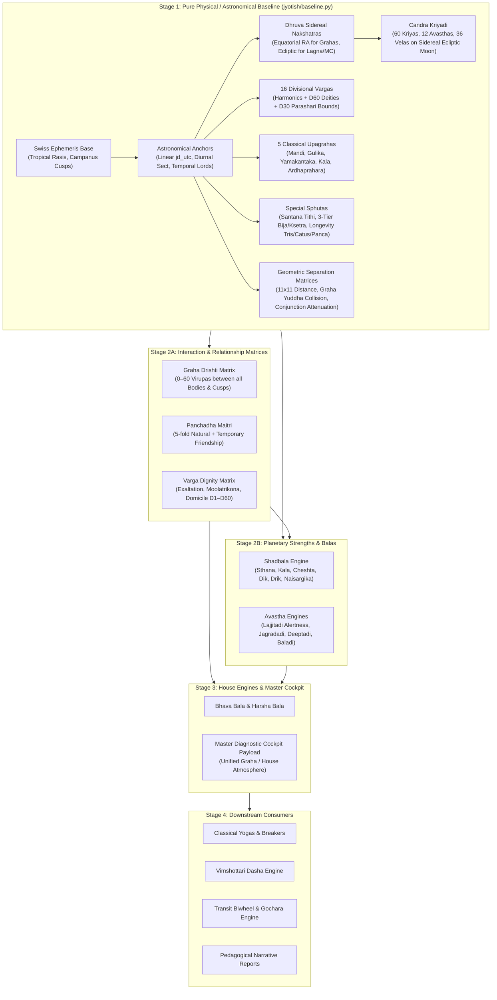

# Astra Architectural Refactoring Blueprint: Single Source of Truth Pipeline

This blueprint defines the master architectural refactoring for the Astra calculation engine. It establishes a unified, single-source-of-truth computation pipeline using a deterministic, lazy-evaluation Directed Acyclic Graph (DAG) pattern via Python's `@cached_property`.

---

## Current State of the Architecture

* **Stage 1 (`baseline.py`, `baseline_math.py`, `baseline_tables.py`):** 100% Certified.
* **Stage 2A (`relationships.py`):** 100% Certified.
* **Stage 2A (`aspects.py`):** 100% Certified.
* **Stage 2B (`shadbala.py`):** 100% Certified.

---

## 1. Executive Mission & Problem Statement

### The Legacy Problem
Previously, Astra suffered from severe calculation redundancy and parameter drilling:
* Downstream modules (`yogas/breakers.py`, `planetary_evaluation.py`, `report/report_engine.py`, `avasthas/quantitative.py`) received monolithic, ad-hoc dictionaries.
* Modules repeatedly re-extracted raw coordinates, re-invoked angular separation loops `(lon2 - lon1) % 360`, re-checked combustion or retrogression, and re-queried house placements from scratch.
* Circular imports occurred between coordinate calculators and astrological evaluation routines.

### The Architectural Solution
Re-architect the computation pipeline into a **Single Source of Truth** using a phased, 4-stage Directed Acyclic Graph (DAG):
1. **Stage 1 (Completed & 100% Certified):** Master Astronomical & Coordinate Baseline Engine (`ChartBaseline` in `baseline.py`, `baseline_math.py`, `baseline_tables.py`). Computes 100% deterministic physical/geometric facts (ephemeris, coordinates, sensitive points, 16 vargas, upagrahas, and raw distance matrices). Contains **zero house evaluations, zero house atmosphere scoring, zero dignity scoring, and zero Shadbala**.
2. **Stage 2A (Completed & 100% Certified):** Interaction & Relationship Matrices (`relationships.py` and `aspects.py`: Graha Dṛṣṭi 0–60 Virūpas, Pañcadhā Maitrī 5-fold friendship, Varga Dignities, Rāśi Dṛṣṭi, Dynamic Benefic/Malefic breakdown).
3. **Stage 2B (Completed & 100% Certified):** Planetary Strength & Shadbala (`shadbala.py`: 6-fold Shadbala, Sthāna Bala, Kāla Bala, Cheṣṭā Bala, Ayana Bala, Dṛk Bala, Naisargika Bala, Quantitative & Qualitative Avasthās, with Dual-Mode Campanus Kala Parity and Pure Whole Sign Tropical 90° Cardinal Compass architecture).
4. **Stage 3 (Next Focus):** House Evaluation, Atmosphere & Diagnostic Cockpit (Bhāva Bala, Harsha Bala, House Base Scores, Master Diagnostic table).
5. **Stage 4:** Downstream Consumers (Classical Yogas & Breakers, Vimshottari Dashas, Gochara Transits, Full Narrative Reports).

---

## 2. Core Astrological Foundations (Ernst Wilhelm "Kala" Integrated Approach)

All computations across all stages strictly adhere to these scriptural and astronomical axioms:

1. **Tropical Rāśis (Signs):**
   * The 12 signs of the zodiac (Mesha through Meena) are measured along the Tropical zodiac aligned to Earth's equinoxes and solstices ($0^\circ$ Aries = Vernal Equinox).
   * As detailed in Ernst Wilhelm’s *The Mystery of the Zodiac*, Rāśis measure the Earth-Sun seasonal cycle and energy fields.

2. **Campanus House System (Bhāva):**
   * House cusps and boundaries are calculated strictly using the Campanus system (`system 'C'` in `swisseph`).
   * The Prime Vertical is divided into twelve equal $30^\circ$ arcs, projecting houses naturally onto the observer's local space.
   * Campanus cusps are strictly display-only for SVG chart wheel rendering; all astrological calculations, house lordships, and atmosphere scoring operate on Whole Sign Houses. Lagna's exact degree anchors the sensitive point of all charts.

3. **Sidereal Equatorial Nakshatras (Dhruva Galactic Center):**
   * The 27 Nakshatras are fixed to the stars (Sidereal) measured along the celestial equator (Equatorial Right Ascension), anchored by the Dhruva Galactic Center at the midpoint of Mūla ($246^\circ 40'$).
   * Planetary nakshatras use Sidereal Right Ascension: $\text{RA}_{\text{sid}} = (\text{RA}_{\text{planet}} - \text{Ayanāṃśa}_{\text{eq}}) \pmod{360^\circ}$.
   * Sensitive points (Lagna and MC) use Sidereal Ecliptic Longitude: $\lambda_{\text{sid}} = (\lambda_{\text{ecl}} - \text{Ayanāṃśa}_{\text{ecl}}) \pmod{360^\circ}$.
   * Vic DiCara mode (`VIC_CHITRA`) is supported as an alternate toggle using standard Lahiri ecliptic sidereal positions.

4. **Scriptural & Reference Authority:**
   * *Brihat Parashara Hora Shastra* (BPHS): Foundational cross-reference for Vargas, Balas, and Yogas.
   * Mantreśvara’s *Phaladeepika*: Absolute authority for Candra Kriyādi (Ch. 4), Upagrahas (Ch. 25), Childbirth Sphutas (Ch. 12), and Longevity Sphutas (Ch. 17).
   * Ernst Wilhelm’s *Kala* Software Baseline: Mathematical ground truth for Dhruva Ayanamsa, varga calculations, and planetary evaluations.

5. **No Hard-Coding Policy:**
   * Every value must be dynamically derived from Swiss Ephemeris (`swisseph`) base coordinates. Hard-coding lookup values to force tests to pass is strictly prohibited.

---

## 3. Stage 1: The Master Astronomical Baseline (`jyotish/baseline.py`)

Stage 1 is fully decoupled into a clean 3-file modular architecture:
* `jyotish/baseline_tables.py`: Immutable reference catalogs and Sanskrit lookup tables.
* `jyotish/baseline_math.py`: Pure mathematical algorithms and coordinate transformations.
* `jyotish/baseline.py`: The `ChartBaseline` class orchestrator with cached properties.

### Component Structure & Responsibilities

| File | Module Responsibility | Key Components |
|---|---|---|
| `baseline_tables.py` | Static Catalogs | `PLANETS_ORDER`, `ALL_BODIES`, `TARA_GRAHAS`, `ZODIAC_SIGNS`, `NAKSHATRAS`, `NITYA_YOGAS`, `VIMSHOTTARI_SEQUENCE`, `SHASTIAMSA_DEITIES` (all 60 deities and malefic parity mappings), `CHANDRA_KRIYAS_DATA` (60), `CHANDRA_AVASTHAS_DATA` (12), `CHANDRA_VELAS_DATA` (36). |
| `baseline_math.py` | Pure Mathematical Algorithms | `calculate_varga_longitude()` (16 vargas), `calculate_unequal_trimsamsa()` (Parāśarī D30 limits), `calculate_shastiamsa_details()` (half-degree D60 slices with even-sign reversal), `calculate_baladi_state()` (5 age states), `calculate_sub_lord()`, `find_preceding_solar_crossing()` (backward Newton-Raphson solar ingress solver), `get_eq_from_ecl()` (spherical coordinate converter). |
| `baseline.py` | Orchestrator & Public API | `ChartBaseline` class exporting `@cached_property` DAG nodes: `astronomical_anchors`, `separation_matrix`, `shortest_distance_matrix`, `planetary_wars`, `conjunctions`, `combustion_status`, `lunar_phase`, `coordinates`, `nakshatras`, `upagrahas`, `pancanga`, `special_sphutas`, `vargas`, and `to_dict()`. |

### Certified Stage 1 Mathematical Formulas & Rules

1. **Continuous Linear Julian Day UTC:**
   $$\text{JD}_{\text{UTC}} = \text{JD}_{\text{local}} - \left(\frac{\text{Timezone Offset}}{24.0}\right)$$
   Prevents negative fractional hour parameter edge cases across midnight and month/year boundaries.

2. **Sidereal Ecliptic Nityā Yoga:**
   $$\text{Yoga Arc} = (\lambda_{\text{Sun, sid}} + \lambda_{\text{Moon, sid}}) \pmod{360^\circ}$$
   $$\text{Yoga Number} = \left\lfloor \frac{\text{Yoga Arc}}{13^\circ 20'} \right\rfloor + 1$$
   Computed strictly along the ecliptic path using `ecliptic_ayanamsa`, preventing equatorial RA distortion.

3. **Santāna Tithi (Childbirth Fertility):**
   $$\text{Santāna Arc} = [5 \times (\lambda_{\text{Moon}} - \lambda_{\text{Sun}})] \pmod{360^\circ}$$
   Flags Amāvasyā (30th) and Krishna Paksha Chidra tithis (4, 6, 8, 9, 12, 14) as afflicted.

4. **3-Tier Bīja / Kṣetra Sphutas (*Phaladeepika* Ch. 12):**
   * Male Bīja: $\lambda_{\text{Jupiter}} + \lambda_{\text{Sun}} + \lambda_{\text{Venus}}$ (Strong if both Rasi and D9 are in odd signs).
   * Female Kṣetra: $\lambda_{\text{Jupiter}} + \lambda_{\text{Moon}} + \lambda_{\text{Mars}}$ (Strong if both Rasi and D9 are in even signs).

5. **Classical Upagrahas (*Phaladeepika* Ch. 25 & *BPHS* Ch. 3):**
   * Diurnal / nocturnal 8-fold time division: $\text{Part Length} = \frac{\text{Day/Night Length}}{8}$.
   * Derived for Māndi, Gulika, Yamakaṇṭaka, Kāla, and Ardhaprahāra, including their Whole Sign House relative to Lagna.

6. **Longevity Sphutas (*Phaladeepika* Ch. 17):**
   * Trisphuṭa: $(\lambda_{\text{Lagna}} + \lambda_{\text{Moon}} + \lambda_{\text{Māndi}}) \pmod{360^\circ}$ (exposes D9 Navāṃśa sign/degree for Saturn transit tracking).
   * Catuṣphuṭa: $(\text{Trisphuṭa} + \lambda_{\text{Sun}}) \pmod{360^\circ}$
   * Pañcasphuṭa: $(\text{Catuṣphuṭa} + \lambda_{\text{Rāhu}}) \pmod{360^\circ}$

7. **Classical D60 & D30 on Lagna and MC:**
   * D60 Shastiamsa deity details attached to Grahas, Lagna, and MC with even-sign deity reversal.
   * D30 Parāśarī unequal bounds ($5^\circ, 5^\circ, 8^\circ, 7^\circ, 5^\circ$) attached as primary coordinates, with continuous harmonic fields for *Kala* compatibility.

8. **Graha Yuddha (Planetary War):**
   * Evaluated across the 5 Tāra Grahas (Mars, Mercury, Jupiter, Venus, Saturn) with separation $\le 1.0^\circ$.
   * Operates without sign-boundary restrictions ("wall leakage" detected).
   * Venus always wins per *Sūrya Siddhānta* VII.23; other pairs decided by higher Northern Declination.

9. **Cross-Border Conjunctions:**
   * 11x11 separation matrix detects bodies within orb across adjacent signs with a $0.75$ boundary attenuation factor.

10. **Candra Kriyādi (*Phaladeepika* Ch. 4.12–20):**
    * Evaluates 60 Kriyās, 12 Avasthās, and 36 Velās anchored strictly to the Moon’s Sidereal Ecliptic Longitude.

### Golden Verification Benchmark (Native Shivapuri)

| Parameter | Value | Classical / Astronomical Meaning |
|---|---|---|
| **Ascendant (Lagna)** | Leo $9^\circ 35' 56''$ | Sensitive point of chart |
| **Midheaven (MC)** | Aries $18^\circ 58' 57''$ | Projected across all 16 Vargas |
| **Nityā Yoga** | #10 Gaṇḍa (Arc: $126.5862^\circ$) | Sidereal Ecliptic Sum ($207.9582^\circ + 278.6280^\circ$) |
| **Santāna Tithi** | #30 Amāvasyā (Arc: $353.3489^\circ$) | Afflicted (New Moon / 30th Tithi) |
| **Bīja Sphuta** | Aquarius $3^\circ 52'$ (D9: Scorpio) | Mixed (Delayed Progeny) |
| **Kṣetra Sphuta** | Aries $8^\circ 35'$ (D9: Gemini) | Deficient (Both Odd Signs) |
| **Trisphuṭa** | Sagittarius $6^\circ 43'$ | D9 Navāṃśa: Gemini $0^\circ 29'$ |
| **Catuṣphuṭa** | Cancer $24^\circ 38'$ | Cancer Placement |
| **Pañcasphuṭa** | Libra $10^\circ 51'$ | Libra Placement |
| **Moon Equatorial RA** | $281.9997^\circ$ | Śravaṇa, Pada 1 |
| **Moon Sidereal Longitude**| $278.6280^\circ$ | Uttara Aṣāḍhā, Pada 4 |
| **Candra Kriyādi** | Kriyā #54 Yogi, Avasthā #11 Yuvatiparinaya, Velā #33 Punyakarma | Traversal fraction: $0.897100$ (All Auspicious / Shubha) |

---

## 4. Master Phased Implementation Roadmap

### Stage 1: Physical / Coordinate Baseline Engine (COMPLETED & CERTIFIED)
- [x] Pure astronomical baseline class `ChartBaseline` (`jyotish/baseline.py`).
- [x] Modular split into `baseline_tables.py`, `baseline_math.py`, and `baseline.py`.
- [x] Continuous linear Julian Day UTC calculation (`jd_utc`).
- [x] 11x11 relative separation and shortest distance matrices.
- [x] Cross-border Graha Yuddha collision solver (Venus Sovereign Brilliance + Northern Declination).
- [x] Cross-border conjunction attenuation ($0.75$ boundary factor).
- [x] Full 3D coordinates (Ecliptic Lon/Lat + True Equatorial RA/Declination + Speed).
- [x] True Node dynamic retrograde status reflecting direct stations.
- [x] Dhruva Equatorial Nakshatras with symmetrical coordinate schema (`sidereal_ra`, `sidereal_longitude`, `tropical_ra`).
- [x] Sidereal Ecliptic Nityā Yoga.
- [x] 5 Classical Upagrahas with Whole Sign House positions.
- [x] Special Childbirth Sphutas (Santāna Tithi + 3-tier Bīja/Kṣetra).
- [x] Special Longevity Sphutas (Trisphuṭa, Catuṣphuṭa, Pañcasphuṭa with D9 Navāṃśa).
- [x] 16 Divisional Vargas with Midheaven (MC) and Lagna harmonic projections.
- [x] D60 half-degree Shastiamsa deities on Grahas, Lagna, and MC with even-sign reversal.
- [x] D30 Parāśarī unequal bounds on Grahas, Lagna, and MC with continuous harmonic compatibility.
- [x] Candra Kriyādi evaluated strictly on the sidereal ecliptic Moon.
- [x] 100% test pass rate on unit and integration suites (`pytest tests/test_stage1_baseline.py`).

---

### Stage 2A: Interaction & Relationship Matrices (COMPLETED & CERTIFIED)
*Goal: Compute pure relational values between planets, signs, and houses without calculating full Shadbala. Refactors and wraps existing engines (`jyotish/relationships/relationships.py` and `jyotish/aspects/aspects.py`) to consume `ChartBaseline` directly without redundant loops or Swiss Ephemeris calls, maintaining 100% compatibility with downstream engines like `jyotish/shadbala/shadbala.py`.*
- [x] Natural (*Naisargika*), Temporary (*Tatkalika*), and Compound (*Pañcadhā*) Friendship matrices based on *BPHS* Ch. 15.
- [x] Planetary Dignity Matrix across all 16 divisional charts ($D_1$ through $D_{60}$) with configurable debilitation modes (`kala_degree` vs `whole_sign`).
- [x] Master Stage 2A Aspect Orchestrator `calculate_aspect_matrices(baseline: ChartBaseline)`.
- [x] 11x11 dual-indexed Graha Dṛṣṭi matrices (`outgoing` and `incoming` $O(1)$ lookups) with nodes casting 0 Virūpas and receiving aspects.
- [x] 7x12 dual-indexed Cusp Dṛṣṭi matrices (`by_planet` and `by_house` $O(1)$ lookups) anchored to the natal Ascendant's sign:
  $$\text{Target Sign Index}_h = (\text{asc\_sign\_idx} + h - 1) \pmod{12}$$
  $$\text{Cusp Longitude}_h = (\text{Target Sign Index}_h \times 30^\circ + \text{sensitive\_cusp\_degree}) \pmod{360^\circ}$$
- [x] Binary Rāśi Dṛṣṭi sign-to-sign and mutual planetary glance mappings (`planet_to_planet` and `house_to_planets`).
- [x] Dynamic Benefic / Malefic Breakdown (+ / - Net Virūpas) for planets and cusps with:
  * Mercury conjunction rule: malefic if combust or conjoined in the same sign with natural malefics (*BPHS* Ch. 3 / *Phaladeepika* Ch. 2.27).
  * House Lord protection rule: a house lord's aspect on its own whole-sign cusp is always classified as positive/protective (*Phaladeepika* Ch. 15.1–3).
- [x] High-level multi-varga aspect helper `calculate_varga_aspects(baseline, varga="D1")` consuming `baseline.vargas[varga]` directly.
- [x] 100% test pass rate on Stage 2A test fleet (`tests/test_stage2a_interactions.py` and `tests/test_stage2a_aspects.py`).

---

### Stage 2B: Planetary Strength & Shadbala (COMPLETED & CERTIFIED)
*Goal: Migrate Shadbala and Avastha engines to consume Stage 1 + Stage 2A states directly, decoupling calculation engines from Swiss Ephemeris coordinate transformations and establishing pure Whole Sign Tropical 90° cardinal geometry while protecting legacy Kala / Campanus parity.*
- [x] **Polymorphic Ingestion Adapter:**
  * `calculate_shadbala()` accepts modern `ChartBaseline` class instances, serialized dictionaries, or legacy 6-positional argument calls (`planet_positions`, `asc_lon`, `mc_lon`, `jd`, `lon`, `lat`), ensuring 100% backward compatibility.
- [x] **Pure Whole Sign Tropical Dig Bala Geometry:**
  * Cardinal sensitive cusps are strictly projected in 90° intervals from the Ascendant degree:
    $$\text{Cusp}_1 = \text{Asc}, \quad \text{Cusp}_4 = \text{Asc} + 90^\circ, \quad \text{Cusp}_7 = \text{Asc} + 180^\circ, \quad \text{Cusp}_{10} = \text{Asc} + 270^\circ$$
  * Universal linear arc formula from planet's zero point ($\Delta / 3.0$) matching classical texts (*Phaladeepika* Ch. 4 & *BPHS* Ch. 27).
  * Multi-model execution modes via `dig_bala_mode`:
    * `"whole_sign"` (**DEFAULT & RECOMMENDED**): Decoupled from Swiss Ephemeris 3D routines, eliminating high-latitude quadrant distortion.
    * `"campanus"`: Legacy 3D Campanus house interpolation (`swe.house_pos(..., b'C')`), preserving exact parity with Ernst Wilhelm's Kala software outputs.
    * `"quadrant_mc"`: Longitudinal quadrant interpolation using spatial MC.
- [x] **Dual-Mode Kendra Bala (Angular Strength):**
  * Toggled via `kendra_bala_mode`:
    * `"flat_parashara"` (**DEFAULT**): Classical BPHS and Ernst Wilhelm *Kala* standard (Kendras 1, 4, 7, 10 = 60.0 Virūpas; Panaparas 2, 5, 8, 11 = 30.0 Virūpas; Apoklimas 3, 6, 9, 12 = 15.0 Virūpas).
    * `"tapered_phaladeepika"`: Mantreśvara’s tapered model (*Phaladeepika* Ch. 4, Text 8 / Vic DiCara) where strength decreases by $1/4$ from Lagna in each square (Kendras: 60.0, 45.0, 30.0, 15.0; Panaparas: 30.0, 22.5, 15.0, 7.5; Apoklimas: 15.0, 11.25, 7.5, 3.75).
  * Exported with 2-decimal precision (`round(kendra, 2)`) to preserve quarter-point values ($11.25$, $3.75$).
- [x] **Saptavarga Bala Direct Consumption:**
  * Consumes Stage 1 `baseline.vargas` for D1–D12 and Stage 2A compound relationships (`compound_relationships`) without redundant loops or re-evaluations.
  * Correctly computes harmonic D30 for Saptavarga dignity to guarantee exact numerical parity with Kala software baseline CSVs.
- [x] **Cheṣṭā Bala & Declination Corrections:**
  * Analytical motional anomaly (*Cheshta Kendra*) calculation with Keplerian *Manda Phala* correction for inferior planets ($e \cdot \sin(E) \cdot \cos(i)$).
  * Sun and Moon Cheshta Bala derived from Ayana Bala and Paksha Bala respectively per BPHS 28.18.
- [x] **Dṛk Bala via Stage 2A Graha Dṛṣṭi Matrix:**
  * Directly consumes `aspect_matrices["graha_drishti"]["incoming"][p]`.
  * Dynamic Moon beneficence derived from illumination percentage and waxing state in `lunar_phase` (Paksha Bala $\ge 30$ Virūpas).
- [x] **Parāśarī Minimum Normalization:**
  * Planetary strength is normalized against individual Parāśarī minimum thresholds (`REQUIRED_TOTAL`: Mercury 420, Sun/Jupiter 390, Moon 360, Venus 330, Mars/Saturn 300) rather than a flat divisor.
- [x] **Dual-Mode Benchmark Suite & Zero-Breakage Certification:**
  * `tests/test_stage2b_shadbala.py` certifies both legacy Kala / Campanus parity and Astra's pure Whole Sign Tropical architecture on the Angelina Jolie benchmark.
  * Verified 100% green across all 94 targeted mathematical, varga, avastha, and interaction tests (`pytest`).

---

### Stage 3: House Engines & Diagnostic Cockpit (NEXT FOCUS)
*Goal: Synthesize planet and house states into the Master Diagnostic Table.*
* **1. Bhāva Bala (House Strength):**
  * Bhāvadhipati Bala (Lord's strength), Bhāva Dig Bala, Bhāva Dṛṣṭi Bala.
* **2. House Atmosphere & Base Scores:**
  * Auspicious and inauspicious influences on each of the 12 houses.
  * Harsha Bala for 6th, 8th, and 12th houses.
* **3. Master Diagnostic Cockpit Payload:**
  * Complete 9-column tabular data for UI consumption matching ADR-006 design standards.

---

### Stage 4: Downstream Consumers & Narrative Synthesis
*Goal: Wire user-facing interpretation and timing modules to the certified engine.*
* **1. Classical Yogas & Breakers Engine:**
  * Rāja Yogas, Dhana Yogas, Vipareeta Rāja Yogas, Nodal combinations, and their respective cancellation conditions (*Bhangas*).
* **2. Vimshottari Dasha Engine:**
  * Mahadashas, Antardashas, Pratyantardashas calculated to high precision from birth Julian Day.
* **3. Gochara (Transit) Engine:**
  * Real-time planetary transits overlaid on natal Campanus cusps and divisional placements.
* **4. Pedagogical Narrative Report Engine:**
  * Automated synthesis of high-fidelity client and astrological case studies.
