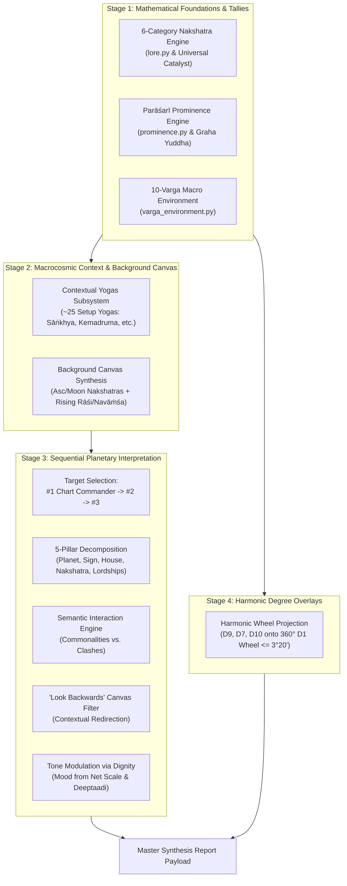

# Astra Chart Synthesis & Report Subsystem Architecture (`jyotish/report/`)

## 1. Architectural Philosophy & Objective

The Astra report subsystem implements the four-stage chart assessment and synthesis methodology developed by Vic DiCara and grounded in classical Parāśarī Jyotiṣa, integrated with Ernst Wilhelm's precision Kala computations.

Rather than presenting isolated, disjointed astrological fragments, this engine synthesizes the birth chart into a coherent human portrait:
1. **Prominence first:** Identifying which planets command the loudest volume and stage presence (*#1 Chart Commander*).
2. **Context before detail:** Establishing the native's macro-environmental canvas and baseline worldview (*Contextual Yogas* and *Background Canvas*) before individual placements are analyzed.
3. **5-Pillar Archetypal Decomposition:** Systematically breaking down each planet into Planet, Sign, House, Nakshatra, and Lordships.
4. **Commonalities vs. Clashes:** Evaluating psychological resonances and friction points strictly through Elements (Fire, Earth, Air, Water) and Modalities (Movable, Fixed, Dual).
5. **Dignity as Tone Modulation:** Ingesting existing dignity purely as descriptive psychological mood without corrupting mathematical prominence or dignity scores.

---

## 2. Directory Structure & Modular Decoupling

Following Astra's twin-markdown architectural standard, every computational engine is paired with its dedicated theoretical proof and mathematical documentation:

| Module | Documentation | Responsibility |
| :--- | :--- | :--- |
| [`prominence.py`](file:///Users/hajnaljanos/PycharmProjects/astra/jyotish/report/prominence.py) | [`prominence.md`](file:///Users/hajnaljanos/PycharmProjects/astra/jyotish/report/prominence.md) | Computes planetary volume via 8 Parāśarī opportunity vectors, resolves Classical Graha Yuddha, and designates the #1 Chart Commander. |
| [`varga_environment.py`](file:///Users/hajnaljanos/PycharmProjects/astra/jyotish/report/varga_environment.py) | [`varga_environment.md`](file:///Users/hajnaljanos/PycharmProjects/astra/jyotish/report/varga_environment.md) | Evaluates the 10-Varga (*Daśavarga*) macro-environmental balance with prominence scaling and thermodynamic deviations. |
| [`contextual_yogas.py`](file:///Users/hajnaljanos/PycharmProjects/astra/jyotish/yogas/contextual_yogas.py) | [`contextual_yogas.md`](file:///Users/hajnaljanos/PycharmProjects/astra/jyotish/yogas/contextual_yogas.md) | Evaluates ~25 baseline setup yogas: 7 Sāṅkhya yogas, Sun-Moon geometry, Mahābhāgya, Kemadruma tiers, and Solar Flanking. |
| [`interpretation_engine.py`](file:///Users/hajnaljanos/PycharmProjects/astra/jyotish/report/interpretation_engine.py) | [`interpretation_engine.md`](file:///Users/hajnaljanos/PycharmProjects/astra/jyotish/report/interpretation_engine.md) | Synthesizes the background canvas, decomposes planets into 5 pillars, assesses elemental/modality clashes, and modulates tone via dignity. |
| [`report_engine.py`](file:///Users/hajnaljanos/PycharmProjects/astra/jyotish/report/report_engine.py) | [`TASK_LIST.md`](file:///Users/hajnaljanos/PycharmProjects/astra/jyotish/report/TASK_LIST.md) | Master high-level orchestrator assembling all modular sub-engines into a backwards-compatible frontend payload. |

---

## 3. Core Subsystems

### A. Parāśarī Prominence Engine ([`prominence.py`](file:///Users/hajnaljanos/PycharmProjects/astra/jyotish/report/prominence.py))
* **Formula:** $\text{Prominence Score} = \text{SBR} \times (1.0 + \sum \text{Opportunity Weights})$.
* **Baseline Normalization:** $\text{SBR} = \frac{\text{Calculated Rupas}}{6.0\text{ Rupas}}$, eliminating artificial bias from textbook minimum divisors.
* **Classical Graha Yuddha:** Venusian immunity (*Bhṛgu* exception), Northern Declination victor, and seamless Virūpa/Rupa scaling.
* **Calibrated Opportunity Groups:** Core Anchors (Ascendant, Moon, Sun), Aspect Volume (Sphuṭa Dṛṣṭi), Houses (Kendra/Koṇa stage sharing), and Miscellaneous Roots (calibrated dispositor tree capped at $+0.15$).

### B. 10-Varga Macro Environment ([`varga_environment.py`](file:///Users/hajnaljanos/PycharmProjects/astra/jyotish/report/varga_environment.py))
* Uses Vic DiCara’s exact 10-Varga model ($D_1: 2.0, D_{60}: 3.33, \text{others}: 1.0$, total $13.33$).
* Scales graha contributions by individual Prominence scores.
* Categorizes thermodynamic deviations into Surplus ($> +2\%$), Deficit ($< -2\%$), and Balanced ($\pm 2\%$) across Elements, Modalities, Polarities, and Ayurvedic Doshas.

### C. Contextual Setup Yogas ([`contextual_yogas.py`](file:///Users/hajnaljanos/PycharmProjects/astra/jyotish/yogas/contextual_yogas.py))
* Assesses baseline native orientation prior to individual planetary analysis.
* Computes 7 Sāṅkhya distribution patterns (*Gola*, *Yuga*, *Śūla*, *Kedāra*, *Pāśa*, *Dāma*, *Veena*), Sun-Moon quadrant geometry, Mahābhāgya fortune yoga, 3-tier Kemadruma lunar isolation with cancellation (*Bhaṅga*), and solar flanking yogas (*Veśi*, *Vośi*, *Ubhayācarī*).

### D. Sequential Interpretation Engine ([`interpretation_engine.py`](file:///Users/hajnaljanos/PycharmProjects/astra/jyotish/report/interpretation_engine.py))
* Prioritizes interpretation order strictly by Prominence rank (#1 Chart Commander first).
* 5-Pillar archetypal decomposition (Symbolism, Sign, House, Nakshatra, Lordships).
* Dynamic resonance vs. clash semantics evaluated strictly via Elements and Modalities.
* Tone modulated through read-only dignity (*Dīptādi*, *Bālādi*, Net Scale Score).
* Continuous harmonic degree overlays ($D_9, D_7, D_{10}$ onto $D_1$) flagging alignments within $3^\circ 20'$.

---

## 4. Quality Assurance & Regression Testing

The entire report subsystem is verified by dedicated unit and integration suites in `tests/`:
* `test_prominence_engine.py`: Graha Yuddha, 8 Parāśarī opportunity factors, dispositor calibration, dynamic Viṃśopaka scores, and Steve Jobs chart commander verification.
* `test_varga_environment.py`: Daśavarga weighting ($13.33$ sum) and thermodynamic deviation flags.
* `test_contextual_yogas.py`: All ~25 contextual setup yogas.
* `test_interpretation_engine.py`: 5-pillar decomposition and semantic dynamics.
* `test_harmonic_overlay.py`: Harmonic projections onto natal wheel.
* `test_report_engine.py`: Master payload assembly and backwards compatibility.
