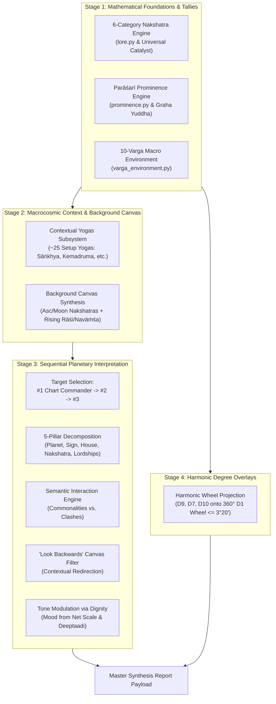

# Astra Report Subsystem & Chart Interpretation Engine
## Master Implementation Blueprint & Exhaustive Task List

> **Target Directory:** `jyotish/report/`  
> **Methodology:** Classical Parāśarī Jyotiṣa integrated with Vic DiCara's Interpretive Synthesis & Ernst Wilhelm's Kala Calculations.  
> **Status:** Completed & Fully Verified (147 Tests Passing)  

---

## 1. Executive Summary & Architectural Overview

The Astra report subsystem is being elevated from an initial summary calculator into a full-scale **Four-Stage Chart Assessment and Synthesis Engine**:

### Immutable Architectural Rules
1. **Dignity is Read-Only for Interpretation:** Never alter the core dignity calculation pipeline (`planetary_evaluation.py`, `vimshopak_score`, `net_scale_score`, `deeptadi`, `balaadi`, `expression_mode`). The interpretation engine ingests existing dignity strictly as *tone modulation* (psychological mood and constructive vs. challenging behavior).
2. **Modular Decoupling:** Keep `report_engine.py` as a lightweight orchestrator by delegating distinct mathematical and interpretive responsibilities to dedicated modules:
   - `jyotish/report/varga_environment.py` (New)
   - `jyotish/report/prominence.py` (New)
   - `jyotish/yogas/contextual_yogas.py` (New)
   - `jyotish/report/interpretation_engine.py` (New)
   - `jyotish/nakshatras/lore.py` (Refactor: 6-Class Nakshatras & Universal Catalyst)
   - `jyotish/report/report_engine.py` (Refactor: Orchestrator)
3. **No Hard-Coding:** All calculations must be dynamically derived from the Swiss Ephemeris data structures.

---

## 2. Work Breakdown Structure (WBS) & Step-by-Step Task List

### Phase 1: Nakshatra Temperament Engine Refactor (6-Group Model)
*Focus: Eliminate Mishra as a 7th standalone group, institute the 6 classical Parāśarī classes, and implement the Universal Catalyst rule for Krittika & Vishakha.*

- [x] **Task 1.1: Refactor `jyotish/nakshatras/lore.py` Metadata & Dossiers**
  - Remove `"Mishra"` from `NAKSHATRA_GROUP_METADATA` and `ALL_NAKSHATRA_GROUPS`.
  - Establish the 6 canonical groups:
    1. `Tikshna` (*Tīkṣṇa* / Bitter & Sharp): Ardra, Ashlesha, Jyeshtha, Mula.
    2. `Ugra` (*Ugra* / Fierce & Strong): Bharani, Magha, Purva Phalguni, Purva Ashadha, Purva Bhadrapada.
    3. `Dhruva` (*Dhruva* / Enduring & Fixed): Rohini, Uttara Phalguni, Uttara Ashadha, Uttara Bhadrapada.
    4. `Mridu` (*Mṛdu* / Sweet & Soft): Mrigashira, Chitra, Anuradha, Revati.
    5. `Laghu` / `Ksipra` (*Kṣipra* / Quick & Light): Ashwini, Pushya, Hasta.
    6. `Chara` / `Cala` (*Cala* / Mobile & Movable): Punarvasu, Swati, Shravana, Dhanishtha, Shatabhisha.
  - Retain the Krittika and Vishakha specific star dossiers while updating their classification logic to reflect the **Universal Catalyst (Fire Sacrifice)** nature.
  - Update `nakshatra_database.json` entries for `Krittika` and `Vishakha` if group references are queried directly.

- [x] **Task 1.2: Implement the Universal Catalyst Rule in `compute_nakshatra_dominance`**
  - Update expected baseline calculation: $\text{Baseline} = \frac{100.0\%}{6} \approx 16.67\%$.
  - When tallying points:
    - Standard stars distribute their calculated weight ($w = \text{base\_weight} \times \text{Prominence}$) to their single assigned group.
    - **Universal Catalyst Rule:** When a body (graha or Lagna) occupies *Kṛttikā* or *Viśākhā*, allocate its calculated points ($1.0 \times \text{Prominence}$) to **all six** nakshatra categories simultaneously.
  - Compute group percentages and deviations: $\text{Deviation} = \text{Percentage} - 16.67\%$.
    - Surplus: $\text{Deviation} > +2.0\%$
    - Deficit: $\text{Deviation} < -2.0\%$
    - Balanced: $-2.0\% \le \text{Deviation} \le +2.0\%$

- [x] **Task 1.3: Encode the Group Resonance & Dissonance Matrix**
  - Implement pairwise compatibility lookup:
    - **Resonances (Harmonious):**
      - *Tīkṣṇa* + *Ugra* (Focused assertive intensity)
      - *Mṛdu* + *Dhruva* (Gentle, stable nourishment)
      - *Kṣipra* + *Cala* (Rapid, flexible adaptation)
      - *Ugra* + *Dhruva* (Formidable, unyielding fortitude)
      - *Mṛdu* + *Cala* (Graceful social and aesthetic rhythm)
    - **Dissonances (Tension/Friction):**
      - *Tīkṣṇa* vs. *Mṛdu* (Incisive severity vs. gentle vulnerability)
      - *Dhruva* vs. *Kṣipra* (Slow permanence vs. impulsive speed)
      - *Dhruva* vs. *Cala* (Immovable conservatism vs. roving restlessness)

- [x] **Task 1.4: Update Frontend & Test Suites**
  - Synchronize `static/js/widgets/report_widget.js` temperament metadata to 6 groups.
  - Update `tests/test_temperament_dossiers.py` and `tests/test_report_engine.py` to assert the 6-group structure with 16.67% baseline.

---

### Phase 2: Dedicated Parāśarī Prominence Engine (`jyotish/report/prominence.py`)
*Focus: Calculate planetary volume (opportunity to express raw strength), resolve Planetary War (Graha Yuddha), and establish the #1 Chart Commander.*

- [x] **Task 2.1: Ingest Raw Strength (Shadbala Rupas) & Shadbala Ratio**
  - Ingest `Total_Rupas` from `shadbala_data`.
  - Calculate $\text{Shadbala Ratio (SBR)} = \frac{\text{Calculated Rupas}}{\text{Required Rupas}}$ using Parāśarī minimums:
    - Mercury: 7.0, Jupiter: 6.5, Moon: 6.0, Venus: 5.5, Sun: 5.0, Mars: 5.0, Saturn: 5.0, Rahu/Ketu: 5.0.

- [x] **Task 2.2: Implement Classical Planetary War (Graha Yuddha)**
  - Eligible participants: Classical 5 true planets (`Mars`, `Mercury`, `Jupiter`, `Venus`, `Saturn`). Sun, Moon, Rahu, and Ketu are excluded.
  - War condition: Longitudinal distance $\le 1^\circ 00'$ in D1.
  - Winner determination:
    - **Venusian Exception:** Venus never loses a planetary war (*Bhrigu* immunity).
    - For all other contestants: The planet with higher northern celestial declination (Krānti) wins (positive declination > negative declination).
  - Score transfer:
    - Calculate point difference: $\Delta = |\text{Rupas}_1 - \text{Rupas}_2|$.
    - Winner gains $\Delta$; loser is penalized by $\Delta$ (floored at 0.0).

- [x] **Task 2.3: Implement the 8 Parāśarī Opportunity Factors (Purging Jaimini Karakas)**
  - Fully remove Jaimini Atmakaraka (AK) and Amatyakaraka (AmK) weights.
  - Factor 1: **Sudarśana Cakra Alignment & Aspects:**
    - Proximity and aspect to Ascendant degree ($1.00 \times \text{weight}$), Moon degree ($0.75 \times \text{weight}$), and Sun degree ($0.50 \times \text{weight}$).
  - Factor 2: **Sensitive Cusp Doors:**
    - Degree alignment with numerical degrees of Ascendant ($1.00$), Moon ($0.75$), and Sun ($0.50$) across all 12 Campanus house cusps (independent of formal aspect angles).
  - Factor 3: **Ascendant Lord Aspect:**
    - Sovereign boost for Lagna Lord (+0.30) + quantified aspectual impact cast onto the 1st house ruler.
  - Factor 4: **Total Sphuṭa Dṛṣṭi Volume:**
    - Sum of all aspect units cast by the planet + sum of all aspect units received by the planet.
  - Factor 5: **House Prominence & Stage Sharing:**
    - Kendra baseline: 10th house (highest), followed by 1st, 4th, 7th.
    - Koṇa baseline: 9th house (highest), followed by 5th.
    - Stage Sharing: If multiple planets occupy the same house, divide that house's stage opportunity weight by the number of occupants.
  - Factor 6: **Dispositor Tree Mechanics:**
    - Trace dispositor chains to root dispositors.
    - Add opportunity boost if dispositing the 1st Lord, Sun, or Moon.
    - Add major bonus if the planet is the **Final Dispositor** (ultimate terminal dispositor of the chart).
  - Factor 7: **Nodal Amplification:**
    - Proximity-based boost when conjunct or closely aspecting Rahu or Ketu.
    - Extra amplification if within 3° eclipse orb.
  - Factor 8: **Birth Daśā Lord:**
    - Baseline opportunity boost (+0.25) granted to the ruler of the starting Vimśottarī Daśā at birth.

- [x] **Task 2.4: Prominence Leaderboard & #1 Chart Commander**
  - Compute total score:
    $$\text{Prominence Score} = \text{Shadbala Ratio} \times (1.0 + \sum \text{Opportunity Weights})$$
  - Sort planets descending.
  - Formally designate Rank #1 as the **#1 Chart Commander (Kārakādhipati)**.
  - Export structured mapping `{graha: prominence_score}` for downstream engines.

---

### Phase 3: Dedicated 10-Varga Macro Environment (`jyotish/report/varga_environment.py`)
*Focus: Replace 6-varga weights with Vic DiCara’s exact 10-Varga (Daśavarga) model, scaling contributions by planetary prominence.*

- [x] **Task 3.1: Daśavarga Weight Distribution Configuration**
  - Implement exact weights summing to $13.33$:
    - $D_1$ (Rāśi): **2.0**
    - $D_{60}$ (Ṣaṣṭyaṁśa): **3.33** ($3\frac{1}{3}$)
    - 8 Vargas ($D_2, D_3, D_7, D_9, D_{10}, D_{12}, D_{16}, D_{30}$): **1.0** each
    - Total Weight Sum = $2.0 + 3.33 + 8.0 = 13.33$

- [x] **Task 3.2: Scaled Planetary & Lagna Contributions**
  - For each graha $g \in \{\text{Sun, Moon, Mars, Mercury, Jupiter, Venus, Saturn, Rahu, Ketu}\}$:
    $$\text{Contribution}(g, v) = \text{Prominence}(g) \times \left(\frac{W_v}{13.33}\right)$$
  - Assign Ascendant (Lagna) a fixed baseline prominence boost equivalent to an average strong planet ($1.0 \times \text{boost}$).

- [x] **Task 3.3: Thermodynamic Deviation & Tally Calculations**
  - Tally weighted points across:
    - **Elements (Mahābhūtas):** Fire, Earth, Air, Water (Baseline mean: 25.0%).
    - **Modalities (Guṇas / Gatis):** Movable (Rajas / Chara), Fixed (Tamas / Sthira), Dual (Sattva / Dvisvabhāva) (Baseline mean: 33.3%).
    - **Polarities:** Active / Masculine (Odd signs), Passive / Feminine (Even signs) (Baseline mean: 50.0%).
  - Compute deviation from baseline: $\text{Deviation} = \text{Percentage} - \text{Baseline}$.
  - Flag classifications:
    - *Surplus:* $> +2.0\%$
    - *Deficit:* $< -2.0\%$
    - *Balanced:* Within $\pm 2.0\%$
  - Provide structured data breakdown for visual bi-directional charts.

---

### Phase 4: Contextual Yogas Subsystem (`jyotish/yogas/contextual_yogas.py`)
*Focus: Evaluate the ~25 contextual setup yogas establishing the native's baseline worldview before individual planets are interpreted.*

- [x] **Task 4.1: Sāṅkhya Yogas (Pattern of Distribution)**
  - Tally count of unique signs occupied by the classical 7 planets (Sun through Saturn):
    - 1 Sign: *Gola Yoga* (Extremely concentrated, intense, narrow life focus)
    - 2 Signs: *Yuga Yoga* (Dualistic struggle, heavy reliance on others)
    - 3 Signs: *Śūla Yoga* (Sharp, piercing ambition, austere resolve)
    - 4 Signs: *Kedāra Yoga* (Agricultural patience, grounded, hardworking)
    - 5 Signs: *Pāśa Yoga* (Tied to family, bondage to duty, networking)
    - 6 Signs: *Dāma Yoga* (Generous, widely skilled, helpful benefactor)
    - 7 Signs: *Veena Yoga* (Harmonious versatility, aesthetic, musical life)

- [x] **Task 4.2: General Scope Yogas (Sun-Moon Quadrant Geometry)**
  - Evaluate Moon's house position relative to Sun:
    - Kendra (1, 4, 7, 10 from Sun): High visibility, prominent self-expression.
    - Panaphara (2, 5, 8, 11 from Sun): Moderate resources, steady middle-phase growth.
    - Apoklima (3, 6, 9, 12 from Sun): Subdued or introspective worldly posture.

- [x] **Task 4.3: Mahābhāgya Yoga (Supreme Fortune Synergies)**
  - Check day/night sect and gender polarities:
    - **Male Native:** Day birth + Lagna in Odd Sign + Sun in Odd Sign + Moon in Odd Sign.
    - **Female Native:** Night birth + Lagna in Even Sign + Sun in Even Sign + Moon in Even Sign.

- [x] **Task 4.4: Śubha & Aśubha Solitary House Yogas**
  - Check for isolated benefics or malefics in the 1st house or flanking the 2nd/12th axis:
    - Solitary Mars in 1st: *Aśubha* extreme physical grit/fortitude at the expense of gentility.
    - Benefic flanking (*Śubhakartari*) vs. malefic flanking (*Pāpakartari*).

- [x] **Task 4.5: 3-Tier Kemadruma Yoga (Lunar Isolation & Rescue)**
  - **Tier 1:** No planets (excluding Sun, Rahu, Ketu) in 2nd and 12th from Moon.
  - **Tier 2:** Moon not occupying a Kendra from Lagna.
  - **Tier 3:** No classical planets occupying Kendras from Moon.
  - Evaluate cancellation (*Kemadruma Bhaṅga*) and output psychological diagnosis (subjective feeling of emotional isolation vs. self-reliant detachment).

- [x] **Task 4.6: Solar Flanking Yogas**
  - Inspect 2nd and 12th houses from Sun (excluding Moon, Rahu, Ketu):
    - *Veśi Yoga:* Planet in 2nd from Sun (Skillful worldly manifestation and wealth).
    - *Vośi Yoga:* Planet in 12th from Sun (Philosophical vision, charitable release).
    - *Ubhayācarī Yoga:* Planets in both 2nd and 12th from Sun (Well-rounded executive leadership).

- [x] **Task 4.7: Dual-Lagna Raja Yoga Verification**
  - Validate classical Kendra-Koṇa combinations evaluated simultaneously from both **Lagna** (external life) and **Candra-Lagna** (mental/experiential life).

---

### Phase 5: Macrocosmic Background Canvas Synthesis
*Focus: Combine the two foundational molecules into a unified 4-string sitār background canvas.*

- [x] **Task 5.1: Synthesize Molecule 1 (Asc Nakshatra ⟷ Moon Nakshatra)**
  - Integrate Ascendant Nakshatra (Action / Ahaṃkāra / Bodily vehicle) with Moon Nakshatra (Perception / Manas / Mental digestive filter).
  - Calculate Panchadha Maitri between star rulers and elemental compatibility (Tattva harmony vs. clash).

- [x] **Task 5.2: Synthesize Molecule 2 (Rising Rāśi ⟷ Rising Navāṁśa)**
  - Integrate Rising Rāśi (D1 tree / outer physical playground) with Rising Navāṁśa (D9 fruit / inner soul trajectory).
  - Check Vargottama Lagna boost.

- [x] **Task 5.3: Generate Unified Canvas Diagnostics**
  - Formulate the baseline personality canvas across 4 spectrums:
    1. *Introversion vs. Extroversion* (Solar/Lunar polarity + Active/Passive signs).
    2. *Practicality vs. Idealism* (Earth/Water vs. Fire/Air thermodynamic tally).
    3. *Individual Defiance vs. Social Cooperation* (Tīkṣṇa/Ugra vs. Mṛdu/Cala nakshatra dominance).
    4. *Intellectual vs. Emotional Processing* (Air/Mercury/Sun vs. Water/Moon/Venus predominance).

---

### Phase 6: Sequential Planetary Interpretation Engine (`jyotish/report/interpretation_engine.py`)
*Focus: Decompose planets into 5 pillars, compare themes for commonalities vs clashes, filter through the background canvas, and modulate tone with existing dignity.*

- [x] **Task 6.1: Sequential Target Selection**
  - Prioritize interpretation order strictly by the Prominence Leaderboard:
    - Target 1: **#1 Chart Commander**
    - Target 2: #2 Planet
    - Target 3: #3 Planet
    - Followed by remaining grahas.

- [x] **Task 6.2: 5-Pillar Decomposition Pipeline**
  - For each target planet, unpack its 5 architectural pillars:
    1. *Natural Planetary Symbolism:* Archetypal significations extracted from `significations_data.json`.
    2. *Rāśi Sign:* Zodiacal sign placement and governing element/modality.
    3. *Bhāva House:* Campanus house placement and life department.
    4. *Nakshatra:* Asterism occupied and temperament class.
    5. *House Lordships:* Houses ruled in D1 (Kendra, Koṇa, Dusthana, Trishadaya).

- [x] **Task 6.3: Semantic Interaction Engine (Commonalities vs. Clashes)**
  - Compare theme pairs across the 5 pillars:
    - **Commonality (Resonance):** Reinforcing symbolic overlap produces prominent life gifts and distinct core talents.
    - **Clash (Dissonance):** Contradictory archetypes do not cancel each other out; they form specific developmental friction points, internal dilemmas, or growth engines.

- [x] **Task 6.4: "Look Backwards" Macro Canvas Filter**
  - Filter planetary synthesis through the Background Canvas:
    - *Example 1 (Spiritual vs. Rational Canvas):* If Jupiter signifies religion or philosophy, but the background canvas is heavily skeptical/intellectual (e.g. Gemini/Virgo Air-Earth surplus), re-route interpretation toward jurisprudence, scientific logic, or ethical codes.
    - *Example 2 (Wealth Expression):* If Venus/2nd Lord indicates wealth, but canvas has high Jyeṣṭhā/Magha with deficient Earth, interpret wealth as status and social dominance rather than liquid savings.

- [x] **Task 6.5: Tone Modulation via Existing Dignity**
  - Ingest `expression_mode` ("Constructive" vs. "Challenging"), `net_scale_score`, and `deeptadi` / `balaadi` avasthas:
    - *Constructive / High Score:* Emphasize noble, generous, functional manifestations.
    - *Challenging / Negative Score:* Highlight stressed, defensive, or obstructive patterns.
    - *Deeptaadi States:* Ingest descriptive psychological states (*Swastha* = Self-reliant ease, *Mudita* = Delight, *Khala* = Agitated/Defensive) as descriptive tonal color.

---

### Phase 7: Degree-Specific Harmonic Varga Overlay
*Focus: Project harmonic positions onto the natal wheel to spot sensitive degree conjunctions.*

- [x] **Task 7.1: Calculate Continuous Harmonic Degree Longitudes**
  - Project harmonic coordinates for $D_9$ (Navāṁśa), $D_7$ (Saptāṁśa), and $D_{10}$ (Daśāṁśa) onto the 360° natal $D_1$ wheel.
- [x] **Task 7.2: Conjunction & Sensitive Angle Alignment Audit**
  - Check for close conjunctions ($\le 3^\circ 20'$, the length of one Navāṁśa pada):
    - Varga planet conjoining natal $D_1$ planet.
    - Varga planet conjoining natal Ascendant degree or Midheaven (MC).
  - Output explicit harmonic resonance tags highlighting reinforced themes.

---

### Phase 8: Master Orchestrator Refactor (`jyotish/report/report_engine.py`) & UI Integration
*Focus: Assemble modular outputs into a clean, backwards-compatible report payload.*

- [x] **Task 8.1: Orchestrate Engine Calls**
  - In `report_engine.py`, coordinate the calculation pipeline:
    1. `compute_planetary_prominence()`
    2. `compute_varga_environment()`
    3. `compute_contextual_yogas()`
    4. `compute_nakshatra_dominance()` (refactored 6-group)
    5. `compute_polarity_core()` & `compute_operational_axis()`
    6. `synthesize_background_canvas()`
    7. `generate_planetary_interpretations()`
    8. `compute_harmonic_overlays()`
- [x] **Task 8.2: Payload Contract & Backward Compatibility**
  - Ensure the output dictionary preserves existing keys (`polarity_core`, `nakshatra_dominance`, `operational_axis`, `environmental_tally`, `planetary_rankings`, `synthesis_ingredients`) so existing frontend widgets continue to function seamlessly without regressions.

---

### Phase 9: Verification, Test Fleet & Quality Assurance
*Focus: Guarantee mathematical integrity and zero regressions.*

- [x] **Task 9.1: Unit Tests for New Modules**
  - `tests/test_prominence_engine.py`: Test Graha Yuddha (Venus immunity, Northern declination winner), 8 Parāśarī opportunity factors, and #1 Commander designation.
  - `tests/test_varga_environment.py`: Test Daśavarga weighting ($13.33$ total sum) and element/modality/polarity deviation flags.
  - `tests/test_contextual_yogas.py`: Test Sāṅkhya yogas, Mahābhāgya, Kemadruma tiers, and solar flanking.
  - `tests/test_interpretation_engine.py`: Test 5-pillar decomposition and commonality vs. clash logic.
  - `tests/test_harmonic_overlay.py`: Test degree projection and $\le 3^\circ 20'$ conjunction flagging.
- [x] **Task 9.2: Regression Suite Execution**
  - Run `pytest tests/test_report_engine.py` and `pytest tests/test_temperament_dossiers.py` to ensure all tests pass.

---

## 3. Parameter Alignment & Confirmed Decisions

The following mathematical parameters, coefficients, and architectural boundaries have been explicitly confirmed and implemented:

1. **Universal Catalyst (Krittika & Vishakha):**
   - **Confirmed Decision:** Uses the exact same calculation as the other groups. When a body occupies Krittika or Vishakha, its calculated points ($w = \text{base\_weight} \times \text{Prominence}$) are distributed simultaneously across all 6 groups.
   - **Status:** Implemented in `report_engine.py` and verified by tests.

2. **Core Shadbala Integrity & Planetary War:**
   - **Confirmed Decision:** The core Shadbala calculation in `jyotish/shadbala/` remains strictly untouched. The prominence engine in `prominence.py` ingests the calculated Shadbala values directly and resolves Graha Yuddha (Planetary War) point transfers within prominence scoring without altering the baseline Jyotish engine.
   - **Status:** Implemented in `jyotish/report/prominence.py` with Venusian immunity and Northern Declination victory.

3. **Opportunity Vectors in Prominence:**
   - **Confirmed Decision:** Classical Parāśarī opportunity weights implemented per the master prompt specifications, completely purging Jaimini AK/AmK weights.
   - **Status:** Implemented across all 8 Parāśarī vectors in `prominence.py`.

4. **Clash & Resonance Semantics for Interpretation:**
   - **Confirmed Decision:** Strictly evaluate clashes and resonances using **Elements (Fire, Earth, Air, Water)** and **Modalities (Movable/Rajas, Fixed/Tamas, Dual/Sattva)** rather than broad subjective polarities.
   - **Status:** Implemented in `jyotish/report/interpretation_engine.py` and verified by tests.

---

*This blueprint is maintained and updated as development progresses across each phase.*
